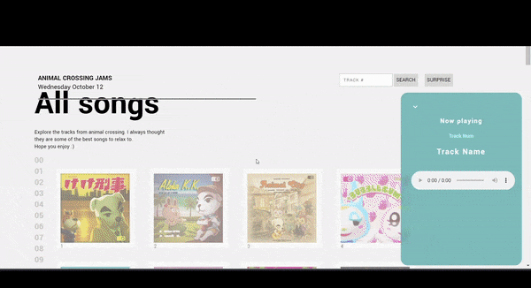

# 📻 Animal Crossing JukeBox Player 

A Jukebox where users choose from a library of songs to relax to. Users can pick and play their desired song or randomize to discover something new.

**Link to project: ** [https://strawberrie68.github.io/AnimalCrossing/index.html]

## 👩‍💻 How It's Made:

**Tech used:** HTML, CSS, JavaScript

FrontEnd - For the frontend I wanted to create a minimal yet simple interface where users could still admire the covers of each song. I decided to use a grid and clean lines to create this interface.

BackEnd - I used the [animal crossing api] (http://acnhapi.com/) and javascript for the backend

## 📝 Lessons Learned:

Although it is a pretty simple web based app, I learned that there are optimal ways to set up an API. Certain structures or depending on how an API set up, it could make it harder or less efficient to fetch the data. 

I also learned the importance of research and planning. I had perceived notions that users will use the app in one way, but they end up wanting to use it another way. For example, I thought the user would pick the songs based on the track number. Instead, the user wanted to find the track by the track title. User needs should always be put first, or else the app is rendered useless.

